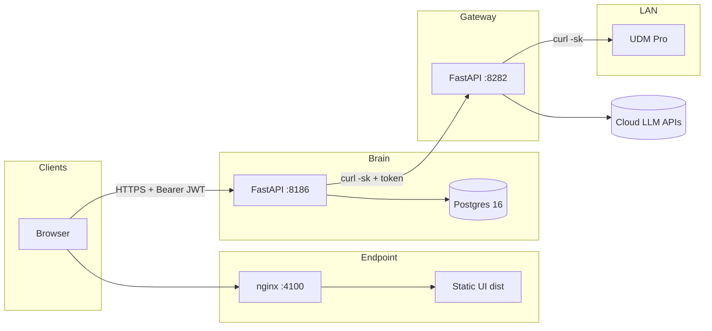

> **⚠️ SUPERSEDED — This document is a historical record. The canonical phase tracker is `JARVIS_Alpha_Phase_Status.md`.**

---

# JARVIS Alpha — Architecture Review (V1)

**Document:** `JARVIS_Alpha_Architecture_Review_V1.md`  
**Scope:** `jarvis-alpha` repository — private successor to `jarvis-core`  
**Status:** Living draft; reflects codebase as of review date.

---

*Some sections reflect the state at initial V1 publication. Post-publication updates are tracked in the changelog at the bottom. Full regeneration is scoped as TD-99.*

---

## 1. Purpose

Jarvis Alpha is a **standalone** control plane and UI stack: orchestration, task graphs, memory/vault surfaces, mesh visibility, and LLM routing. It is **not** wired to call `jarvis-core` in-repo; production cutover is a future phase (see `README.md` phase plan).

---

## 2. High-Level Topology

Physical roles (from `README.md`):

| Node | Role |
|------|------|
| **Brain** | FastAPI API, Postgres, local Ollama, Buddy-related logic |
| **Gateway** | Internet egress, cloud LLM proxy (adapters), UniFi reach to LAN UDM |
| **Endpoint** | Static UI (`ui/dist`), nginx, voice/dashboard hosting |
| **Sandbox** | Forge / dev pipeline (`:5001` health, etc.) |

---

## 3. Alpha Brain

**Stack:** FastAPI, `asyncpg` pool (`brain/db/pool.py`), lifespan hook initializes DB and **`recover_stuck_graphs`** on startup.

**Middleware order (LIFO / last added runs first on request):**  
`TraceIdMiddleware` → `CORSMiddleware` → `JWTAuthMiddleware` → `ApprovalMiddleware` → `RateLimitMiddleware` → `LogMiddleware`.

- **CORS:** `allow_origins` locked to the Endpoint Tailscale UI origin (`brain/app.py`).
- **JWT:** RS256 validation via `ALPHA_JWT_PUBLIC_KEY_PATH`; `SKIP_PATHS` includes `/health`, OpenAPI paths, and **`/v1/auth/pin`**; **OPTIONS** bypasses JWT for preflight (`brain/middleware/jwt_auth.py`).
- **PIN auth:** `POST /v1/auth/pin` validates server-side PIN and issues a long-lived JWT (`brain/routes/pin_auth.py`).

**Representative route modules:** `ask`, `chat`, `memory`, `vault`, `buddy`, `home`, `mesh`, `tasks`, `pin_auth`, **`unifi`** (proxy-only to Gateway).

**Health:** `GET /health` checks DB connectivity and returns `ok` / `degraded`.

---

## 4. Alpha Gateway

**Role:** “Pure adapter” mode — outbound integrations without owning business state.

- **`/v1/cloud/*`:** Provider adapters (Claude, Perplexity, Gemini) behind a single POST shape (`gateway/routes/cloud_routes.py`).
- **`/v1/unifi/*`:** Session-oriented access to UDM Pro over HTTPS on the LAN (`gateway/routes/unifi.py`); Brain never talks to UDM directly.
- **`GET /health`:** Liveness for the gateway process.

---

## 5. Alpha UI

**Build:** Vite + React; **`VITE_BRAIN_URL`** points at the Brain API (not Endpoint nginx for API calls).

**Auth UX:** `PinGate` blocks the app until a valid JWT is in `localStorage`; PIN modal on failure (`ui/src/components/PinGate.tsx`).

**API access:** `apiFetch` / `apiJson` centralize base URL, Bearer injection, and error handling (`ui/src/lib/apiFetch.ts`).

**Operational note:** Commit automation can **`scp`** `ui/dist` to Endpoint after builds (see `scripts/jarvisalpha_commit.sh`); nginx config is in git at `endpoint/nginx/alpha.conf`, deployed via `scripts/deploy_nginx_endpoint.sh`.

---

## 6. Data & Persistence

- **Database:** `jarvis_alpha` on Brain Postgres 16 (`ALPHA_DB_DSN` / `brain/core/config.py`).
- **RLS:** Set per-connection in `brain.db.rls.rls_connection()` (not via middleware); there is no `RLSMiddleware` or duplicate `AuthMiddleware`.

---

## 7. Security & Trust Boundaries

| Boundary | Mechanism |
|----------|-----------|
| Browser → Brain | HTTPS, RS256 JWT after PIN |
| Brain → Gateway | `x-jarvis-token` (and/or env-configured URL); implemented via curl in Brain UniFi proxy |
| Gateway → UDM | TLS to UDM (often self-signed); curl `-sk` + cookie session |
| Brain → Cloud LLM | Via Gateway adapters (not direct from Brain for those paths) |

**Secrets:** Expected on nodes under operator-controlled paths (e.g. `~/jarvis/.secrets`); not stored in git.

---

## 8. Task Execution

- **Dispatch:** `brain/tasks/dispatch.py` routes graph steps to local Ollama models for LLM/code paths; tool agent remains a **stub** pending worker upgrade path.
- **Executor:** In-process execution with recovery for stuck graphs on Brain startup (`brain/tasks/executor.py`).

---

## 9. Known Gaps (V1 Review)

Non-exhaustive; aligns with recent handoffs:

- UniFi **WAN / clients** routes may still return stub data until wired to real UDM API endpoints.
- **WebSocket**-style Buddy updates may be polling-only in UI.
- **jarvis-core** parity items (KI backlog) out of scope for this file.

---

## 10. Change Control

Update this document when:

- New public route prefixes ship on Brain or Gateway.
- Trust boundaries move (e.g. UI proxied through Brain, or Gateway auth changes).
- Major node or port changes are recorded in `README.md` / `brain/config/node_addresses.py`.

---

## Updates Since V1 Publication

### 2026-04-17 — AI-3 closed
- nginx alpha.conf committed at `endpoint/nginx/alpha.conf`
- Deploy mechanism: `scripts/deploy_nginx_endpoint.sh` (copy-validate-reload-verify with auto-rollback)
- Orphaned top-level `nginx/alpha.conf` deleted

### 2026-04-17 — TD-88 v2 shipped (commit/deploy system rewrite)
- Structured JSON events (`##EVT##` sentinel) emitted by pull script on stderr
- Standalone Python renderer (`scripts/render_events.py`) as stream filter
- Auto SSH fan-out Brain → Gateway → Endpoint with halt-on-fail semantics
- Ansible-style additive verbosity (`VERBOSE=1` for raw passthrough)
- Per-deploy audit log at `/tmp/jarvisalpha_commit_YYYYMMDD_HHMMSS.log`

### 2026-04-17 — TD-87 closed (SERVICE_IDENTITY_MODEL.md §7 scope registry)
- §7.2 Gateway scopes table rewritten with 8 accurate scopes matching production token
- §7.7 NEW — Brain service scopes documenting two-token pattern

### 2026-04-17 — TD-86 closed (jarvis-standards canonical docs)
- `AUTHENTICATION_TWO_TOKEN_PATTERN.md` added to jarvis-standards repo

---

*End of Architecture Review V1.*
