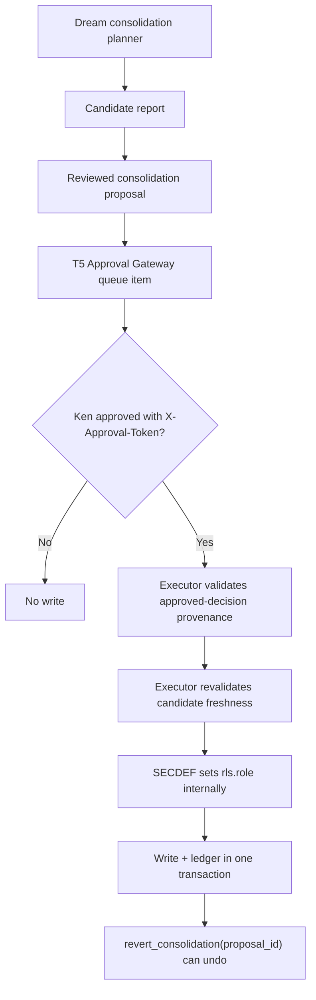

# ADR-0026: Reviewed Consolidation Writes

Date: 2026-06-14

Status: Accepted - Gate A signed

Extends: ADR-0025 Memory 2.0 Dream Consolidation Boundary

## Context

ADR-0025 added a read-only Dream consolidation planner. It identifies memory
promotion, duplicate, decay, and procedural candidates, but it intentionally
does not write memory.

The next Memory 2.0 step is reviewed consolidation writes: converting Dream
planner candidates into reviewable proposals, routing those proposals through
the existing Approval Gateway, and executing only the approved write actions
with a reversible ledger.

The risk is high. Consolidation can change what JARVIS believes about Ken,
children, relationships, legal matters, medical matters, or procedures. Silent
or low-tier writes are not acceptable.

Implementation of this ADR depends on ADR-0025 landing first. PR #368, which
carries ADR-0025 and the read-only Dream consolidation planner, must merge to
`main` before ADR-0026 implementation PRs land.

## Decision

Reviewed consolidation writes will be implemented as a Ken-only, T5-gated
workflow.

- All reviewed-write actions ship at T5.
- Tier differentiation is deferred to a later batch.
- No reviewed-write action may be classified as `security_write`.
- Memory write routes must use explicit T5 route classification.
- The executor must validate approval provenance from the Approval Gateway.
- Proposal `status` alone is never sufficient to execute a write.
- Buddy remains summary and backlog only. Buddy never writes memory.
- Existing candidate collection in `memory_consolidation.py` remains the source
  of reviewed consolidation candidates.
- Only semantic promotion and working-memory archive actions are executable in
  this batch.
- Semantic merge and procedural extraction remain informational and deferred.

## Workflow



## Approval Contract

The Approval Gateway remains the only approval system.

- Proposals are not approvals.
- Proposal status is advisory state only.
- Execution requires an approved decision record from the existing Approval
  Gateway.
- Execution requires `X-Approval-Token` validation for the approved decision.
- A direct database status flip must not be able to execute a consolidation
  write.
- Unknown or unclassified reviewed-write routes must fail closed.
- An approved decision is bound to exactly one `proposal_id`.
- The executor must reject any token whose decision `proposal_id` does not
  match the target proposal.
- Approved decisions are single-use and consumed on execution.
- Tokens must not be reusable across proposals or execution attempts.
- A reverted proposal is terminal. Re-consolidation requires a new proposal and
  a new Approval Gateway decision.

All reviewed-write routes must be explicitly classified as T5. The previous
risk-class-to-tier idea is rejected for this batch. Everything is T5 until a
later ADR defines safe lower-tier cases.

## Write Contract

Every executed consolidation write must be reversible and ledgered.

The memory write and the ledger insert are one atomic operation. The SECDEF
executor must perform both in a single transaction. If the ledger insert fails,
the memory write rolls back. No memory write may exist without its ledger row.

The ledger must record:

- `proposal_id`
- source candidate type
- source memory IDs
- destination memory IDs
- evidence summary
- Approval Gateway decision ID
- actor and execution timestamp
- write operation
- undo operation
- undo payload
- execution result

No hard-delete is allowed.

- Archive means move or flag as archived while remaining restorable.
- Promote means insert a semantic row with a back-link and a demotion path.
- Merge means preserve source rows or archived equivalents with a restore path.
- Revert means `revert_consolidation(proposal_id)` restores the pre-write state.

Before execution, the executor must re-validate candidate freshness:

- The source candidate still exists.
- The source candidate still satisfies its predicate.
- The source row was not already promoted.
- The source row was not evicted.
- The source row still qualifies for the requested archive or promotion action.

Approval provenance validation does not replace candidate revalidation. On
candidate drift, the executor fails closed, marks the proposal stale, and emits
a re-propose signal.

Working-memory archive has precedence over Buddy eviction once proposed. If a
working row has a pending or approved-but-unexecuted archive proposal, Buddy
must not hard-evict that row. The implementation may use a
`consolidation_hold` flag or a proposal lookup, but Buddy's
`evict_expired_working_memory` path must skip held rows. Buddy may continue to
evict non-proposed rows. If the proposal is rejected, the hold is removed and
the row becomes eligible for normal Buddy eviction again.

## Semantic Source

Reviewed Dream consolidation promotions require a first-class semantic source.

`alpha_semantic_memory.source` must add:

```text
dream_consolidated
```

This must ship in its own migration PR. Reviewed consolidation must not reuse
`promoted` because `promoted` does not distinguish automated scoring promotion
from Ken-approved Dream consolidation.

The rollback for this CHECK migration must fail safely if any rows already use
`dream_consolidated`. It must not silently drop the value while rows still
depend on it.

The source tag is not enough by itself. The provenance and revert ledger remains
mandatory for every executed write.

## SECDEF and RLS

All writes must go through SECURITY DEFINER functions.

- SECDEF functions set the required RLS role internally.
- Application code must not rely on `BYPASSRLS`.
- SECDEF executors perform the memory write and ledger insert atomically.
- Child, identity, medical, legal, relationship, and procedural facts remain
  highest-sensitivity reviewed writes.
- Child-scoped writes must verify the child `principal_id` boundary before and
  after execution.
- If the post-execution child `principal_id` boundary check fails, the executor
  must auto-invoke `revert_consolidation(proposal_id)` in the same operation
  and raise a high-priority alert.
- A failed child boundary post-check must never leave a committed write in
  place.

## Proposal Model

The existing read-only candidate collector remains the source of truth for
candidate discovery.

Candidates from `memory_consolidation.py` are converted into proposal rows:

- `review_for_semantic_promotion`
- `merge_duplicate_semantic`
- `review_for_working_decay`
- `review_for_procedural_memory`

The executable mapping for this batch is:

| Candidate action | Proposal treatment | Executor |
|---|---|---|
| `review_for_semantic_promotion` | T5 queue item | `promote_episodic_to_semantic` |
| `review_for_working_decay` | T5 queue item | `archive_working` |
| `merge_duplicate_semantic` | informational only | none |
| `review_for_procedural_memory` | informational only | none |

`review_for_working_decay` maps to archive execution. Decay is implemented as
restorable archive, not hard deletion.

Executable proposals link back to the source candidate evidence and then create
a T5 Approval Gateway queue item. Informational proposals are visible for review
but must not create executable queue items in this batch.

Proposal generation must be idempotent so repeated Dream or Buddy runs do not
spam duplicate approval requests.

## Buddy Boundary

Buddy remains a low-cost summary and backlog helper.

- Buddy may publish count-only backlog summaries.
- Buddy may point Ken to pending proposal counts.
- Buddy must not create memory writes.
- Buddy must not bypass Dream candidate collection.
- Buddy must not execute proposals.
- Buddy must not hard-evict a working row that has a pending or
  approved-but-unexecuted archive proposal.
- Buddy may evict non-held rows normally.
- Rejected archive proposals release the hold and return the row to normal
  Buddy eviction eligibility.

## PR Plan

### Source CHECK migration PR

Purpose: allow reviewed Dream consolidation provenance in semantic memory.

Scope:

- Add `dream_consolidated` to `alpha_semantic_memory.source`.
- Include reversible migration or rollback script matching the repo convention.
- Make rollback fail safely if rows still use `dream_consolidated`.
- Include migration verification.
- No proposal, route, executor, or write behavior.

### PR-1: Schema and T5 Routing

Purpose: introduce proposal and ledger tables plus explicit T5 routes.

Scope:

- Add reviewed consolidation proposal table.
- Add consolidation execution ledger table.
- Add explicit T5 route classifications.
- Add proposal creation endpoint or service path from existing candidates.
- Wire proposals to existing Approval Gateway queue items.
- Queue only semantic promotion and working archive proposals.
- Keep merge and procedural proposals informational.
- Do not execute archive, promote, merge, decay, or procedural writes.

Required tests:

- Proposal creation is idempotent.
- Routes are T5, not `security_write`.
- Unknown classification fails closed.
- Status-only proposal changes cannot execute writes.
- Merge and procedural proposals do not create executable queue items.

### PR-2: Archive and Revert

Purpose: implement reversible archive actions first.

Scope:

- Add SECDEF archive function.
- Add `revert_consolidation(proposal_id)` support for archive operations.
- Validate Approval Gateway decision provenance and `X-Approval-Token`.
- Write provenance and undo payload into the ledger.
- Revalidate candidate freshness before execution.
- Respect Buddy archive holds for pending or approved-but-unexecuted archive
  proposals.

Required tests:

- Approved archive executes.
- Unapproved archive does not execute.
- Status-only flip does not execute.
- Approved write run twice does not double-write.
- Revert restores archived memory.
- Child principal boundary is enforced.
- Stale candidates fail closed and mark the proposal stale.
- Buddy eviction skips held rows and resumes after rejection.
- Ledger insert failure rolls back the memory write.

### PR-3: Promote and Demote

Purpose: implement reviewed semantic promotion and demotion.

Scope:

- Add SECDEF promotion function using `dream_consolidated`.
- Add demotion path through `revert_consolidation(proposal_id)`.
- Preserve evidence, proposal, decision, and undo path in the ledger.
- Revalidate candidate freshness before execution.
- Keep procedural extraction as reviewable proposal output only unless a later
  ADR approves a procedural memory table/write path.

Required tests:

- Approved promotion inserts semantic memory with `dream_consolidated`.
- Unapproved promotion does not execute.
- Approved write run twice does not double-write.
- Demotion removes or archives the promoted semantic row according to the
  ledgered undo path.
- Revert is idempotent.
- Child, identity, medical, legal, relationship, and procedural cases remain T5.
- Token/proposal mismatch is rejected.
- Reverted proposal cannot be re-executed.
- Ledger insert failure rolls back the semantic write.

## Consequences

This keeps Memory 2.0 safe but slower. Every write is Ken-only at first. That is
intentional: the first reviewed-write batch optimizes for trust, reversibility,
and auditability over automation.

Later batches may introduce lower-risk tiers only after production evidence
shows the proposal, approval, executor, and revert ledger are reliable.

## Non-Goals

- No automatic memory writes.
- No low-tier reviewed writes.
- No parallel approval system.
- No reuse of `security_write` for consolidation writes.
- No hard deletes.
- No merge execution.
- No graph memory.
- No Obsidian ingest.
- No procedural memory write path unless a later ADR approves it.

## Gate A Exit Criteria

Gate A is complete because Ken approved this ADR direction on 2026-06-14.

Implementation proceeds as separate PRs in the order listed above. Each PR
remains one concern, reviewable, reversible, and stopped at the human merge
gate.
