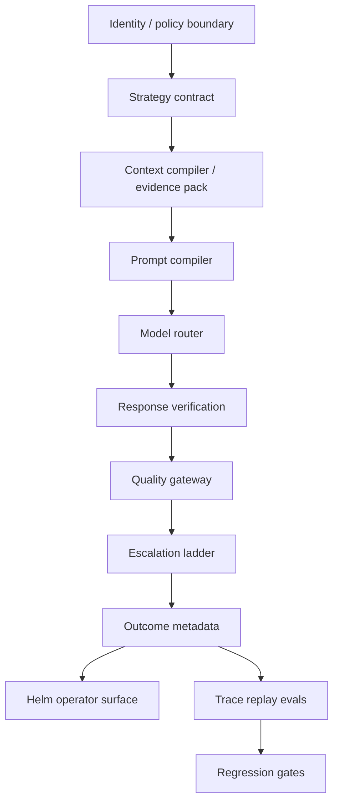
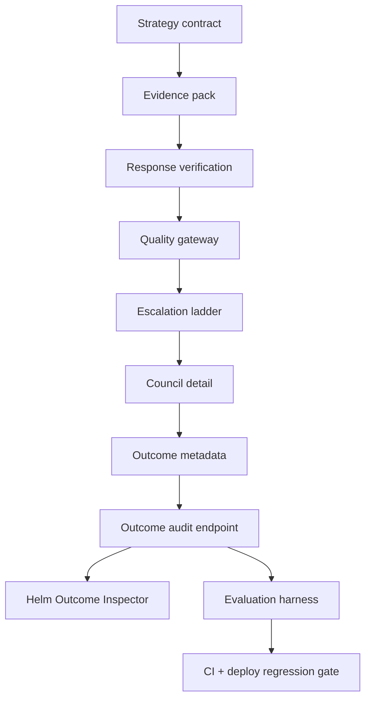

# AT-0 Chat Quality Architecture Review + Gap Ledger

Date: 2026-07-09
Scope: Alpha chat-quality amplification phases 1-13, with Helm as the operator display surface.
Verdict: The shipped system now matches the original direction in architecture shape, but it is not complete. AT-0 has moved beyond routing into context, evidence, verification, escalation, outcomes, and eval gates. The remaining work is to make prompt compilation, memory/RAG packing, model capability scoring, and trace replay first-class.

## Target Architecture

Original product goal: get frontier-style output from lower and mixed-tier models by surrounding them with software architecture, not by copying proprietary prompts.

Current implementation:

## Shipped Phase Ledger

| Phase | Status | Shipped proof | Goal coverage |
|---|---:|---|---|
| Strategy Contract | Done | `brain/routing/strategy.py:32` selects strategy, route mode, model path, and reason. | Turns "Auto" into an inspectable decision. |
| Context Compiler / Evidence Pack | Done, shallow | `brain/services/chat_evidence_pack.py:17` defines memory, internet, web suggestion, AT-0 self, and conversation evidence metadata. | Starts context engineering, but not full prompt compilation. |
| Response Verification | Done, initial | `brain/services/chat_evidence_pack.py:75` defines response verification metadata; chat streaming applies it at `brain/routes/chat.py:1830`. | Catches empty or unsupported verification claims. |
| Quality Gateway | Done, initial | `brain/services/chat_evidence_pack.py:95` defines gateway decisions; chat applies fallback at `brain/routes/chat.py:1881`. | Adds deterministic output repair before user display. |
| Escalation Ladder | Done, initial | `brain/services/chat_evidence_pack.py:122` defines escalation decisions; web-verification cases require Beacon confirmation at `brain/services/chat_evidence_pack.py:200`. | Moves weak answers to retry, Beacon, or operator review. |
| Council Detail v2 | Done | Council compile emits detail and logs `CHAT_COUNCIL_DETAIL_COMPILED` at `brain/routes/chat.py:1964`. | Makes multi-model output inspectable instead of opaque. |
| Outcome Metadata | Done | Chat stores route, verification, quality, and escalation metadata before final streaming at `brain/routes/chat.py:1840`. | Creates audit trail for output quality. |
| Outcome Audit Endpoint | Done | `/v1/chat/outcomes` returns compact outcome rows at `brain/routes/chat.py:2639`; route is classified read and security-read at `brain/middleware/approval_classes.py:135`. | Lets Helm and evals consume output history safely. |
| Outcome Inspector | Done | Helm renders route, model path, quality, escalation, council, evidence, verified, and confirmation fields in `src/ask/AskWorkspace.tsx:5847`. | Operator sees why an answer happened. |
| Evaluation Harness | Done, shallow | `chat_eval_payload()` returns suite status, groups, scoreboard, and zero model calls at `brain/services/chat_evaluation_harness.py:41`. | Establishes deterministic offline regression checks. |
| Helm Eval Surface | Done | Helm reads `/v1/chat/evals` at `src/ask/alphaAskClient.ts:2255` and renders eval status in `src/ask/AskWorkspace.tsx:5895`. | Makes eval state visible without moving authority to Helm. |
| Deploy Regression Gate | Done | `scripts/eval_chat_quality.py:11` exits nonzero on failures; CI runs it at `.github/workflows/trusted-sandbox-ci.yml:135`; deploy runs it at `scripts/jarvisalpha_deploy.sh:487`. | Prevents known strategy/gateway/outcome regressions from shipping. |

## Architecture Fit

| Requirement | State | Evidence | Gap |
|---|---:|---|---|
| Model-agnostic strategy selection | Partial | Strategy plan supports local, Perplexity, Claude, Gemini, council, and deep verify paths in `brain/routing/strategy.py:42`. | No model capability registry, latency/cost score, context-window score, or local-model benchmark table. |
| Better lower-model output | Partial | Evidence pack plus verification/gateway can replace unsafe or unsupported answers before final stream. | No compiled prompt artifact, repair loop, trace replay, or memory/RAG packing policy yet. |
| Context engineering | Partial | Evidence pack records which evidence types were available and whether raw web content is untrusted. | Evidence is metadata-oriented; token budgeting, ranking, redaction, and source packing are not first-class. |
| Verification and repair | Partial | Gateway can fallback on empty or unsupported web claims and escalate. | No iterative self-repair loop or learned repair policy. |
| Operator observability | Strong | Helm surfaces outcome and eval details; Alpha logs quality and escalation decisions. | No trend view or trace replay view. |
| Safety boundary | Strong | Outcome/eval reads are classified `read` and `security_read`; high-risk actions still route through Alpha approvals. | Need MCP/tool-source trust boundaries before broad tool expansion. |
| Evaluation | Partial | Offline deterministic eval suite has golden strategy, quality gateway, and outcome audit groups. | Need real trace replay, failure corpus, and per-model task evals. |

## 11-Pillar Audit

| Pillar | Score | Evidence | Fix |
|---|---:|---|---|
| Scalability | 3 | Strategy and eval are pure local code; outcome endpoint limits rows to 100. | Add model capability registry before adding more providers. |
| Reliability | 3 | Deploy gate now runs chat eval; gateway has fallback responses. | Add trace replay and regression corpus from real failed turns. |
| Security | 4 | Eval/outcome endpoints are authenticated read/security-read. | Define MCP/tool data boundary before external tool expansion. |
| Observability | 4 | Outcome metadata plus Helm inspector exposes route, quality, evidence, and escalation. | Add aggregate trend and trace drilldown only after trace replay exists. |
| Maintainability | 4 | The chain is small modules: routing, evidence pack, eval harness, script gate. | Consolidate phase map in this ledger and keep future phases tied to it. |
| Extensibility | 3 | Strategy names and model paths are typed. | Replace hardcoded model heuristics with registry data. |
| Usability / Accessibility | 3 | Helm uses compact chips and inspector panel. | Improve signed-out auth messaging only if operators still hit confusion. |
| Performance | 4 | Evals run offline with zero model calls. | Add cost/latency measurement when provider calls enter evals. |
| Cost | 4 | Current regression suite has `model_calls: 0`. | Keep trace replay deterministic by default; sample paid model evals separately. |
| Testability | 4 | Tests assert eval groups, outcome scoring, and deploy/CI gate wiring. | Add fixtures from production-safe anonymized traces. |
| Privacy / Compliance | 3 | Outcome metadata is compact and authenticated. | Add redaction rules before trace replay stores prompt/response bodies. |

Weakest pillars: extensibility, privacy/compliance for future traces, and lower-model output quality depth.

## Market Reference Anchors

These are reference anchors, not claims that AT-0 implements each pattern fully.

| Reference | Published practice | AT-0 state |
|---|---|---|
| OpenAI Agents SDK | Official docs describe managed agent loops, handoffs, sessions, tracing, guardrails, and approval pauses: https://developers.openai.com/api/docs/guides/agents | AT-0 has strategy, verification, quality gates, and operator approval boundaries, but not a unified agent loop abstraction. |
| OpenAI Agents tracing | Official tracing docs describe event records for generations, tool calls, handoffs, guardrails, and custom events: https://openai.github.io/openai-agents-python/tracing/ | AT-0 has outcome metadata, but not full trace replay. |
| Anthropic MCP | Official MCP docs describe an open standard for connecting AI apps to tools, data sources, and workflows: https://modelcontextprotocol.io/docs/getting-started/intro | AT-0 should integrate MCP as a tool boundary after prompt/memory/model registry foundations are stable. |
| LangGraph persistence | Official docs separate short-term checkpointer memory and long-term store memory: https://docs.langchain.com/oss/python/langgraph/persistence | AT-0 has memory systems, but chat-quality packing is not yet a first-class retrieval policy. |
| Google ADK | Official ADK docs describe building, testing, evaluating, and deploying agents: https://docs.cloud.google.com/gemini-enterprise-agent-platform/build/adk | AT-0 now has an eval gate; it needs trace replay and model-specific eval datasets. |

## Gap Ledger

| Gap | Type | Pillars hit | User impact | Effort | Priority | Owner | Target date | Verification |
|---|---|---|---|---:|---:|---|---|---|
| Prompt Compiler v2 | Missing | Reliability, maintainability, testability | Lower models still depend on ad hoc prompt assembly and may miss evidence ordering. | M | P0 | Ken/AT-0 TBD | 2026-07-10 | Compiled prompt artifact includes identity, task, evidence, memory, tool policy, output contract, and budget summary. |
| Memory/RAG Packing | Missing | Context engineering, privacy, cost | Useful memory exists but is not consistently packed by relevance, freshness, privacy, and task fit. | M | P0 | Ken/AT-0 TBD | 2026-07-11 | Eval cases prove stale memory loses to Beacon/current evidence and current user facts are packed without oversharing. |
| Model Capability Registry | Missing | Scalability, extensibility, cost | Auto mode cannot reason over model strengths, local/cloud cost, latency, context window, tool ability, or reliability. | M | P1 | Ken/AT-0 TBD | 2026-07-12 | Strategy tests use registry scores rather than hardcoded route heuristics. |
| Trace Replay Evals | Missing | Reliability, observability, testability | The eval suite cannot replay real bad answers or prove repairs improved quality over time. | L | P1 | Ken/AT-0 TBD | 2026-07-13 | Redacted trace fixtures replay through strategy, prompt compiler, verifier, gateway, and expected outcome assertions. |
| Repair loop | Weak | Reliability, output quality | Failed verification can fallback/escalate, but does not yet attempt bounded repair with evidence. | M | P1 | Ken/AT-0 TBD | 2026-07-14 | One bounded repair pass improves answer only when verification failure is fixable and evidence-backed. |
| MCP/tool boundary | At-risk | Security, extensibility | Adding tools without a standard boundary risks prompt injection and inconsistent auth. | M | P1 | Ken/AT-0 TBD | 2026-07-15 | MCP tools are classified, approval-gated, and represented as data/tool results, never instructions. |
| Trend observability | Weak | Observability, usability | Helm shows current eval state, not quality trend or regressions over time. | S | P2 | Ken/AT-0 TBD | 2026-07-16 | Helm displays last run, failed group, and deploy gate status after trace replay exists. |

## Next Build Queue

1. Phase 15: Prompt Compiler v2
2. Phase 16: Memory/RAG Packing
3. Phase 17: Model Capability Registry
4. Phase 18: Trace Replay Evals
5. Phase 19: Repair Loop
6. Phase 20: MCP Tool Boundary
7. Phase 21: Trend Observability

## Facts

- Alpha strategy selection is explicit and returns strategy, route mode, model path, and reason metadata in `brain/routing/strategy.py:23`.
- Evidence packing distinguishes memory, internet, web suggestion, AT-0 self, conversation context, memory priority, and untrusted raw web content in `brain/services/chat_evidence_pack.py:17`.
- Chat streaming applies verification, quality gateway, escalation, outcome metadata, and fallback before final text streaming in `brain/routes/chat.py:1830`.
- Council synthesis receives the same verification/gateway/escalation path in `brain/routes/chat.py:1987`.
- `/v1/chat/outcomes` and `/v1/chat/evals` are read/security-read routes in `brain/middleware/approval_classes.py:135`.
- The deterministic eval harness has golden strategy, quality gateway, and outcome audit groups in `brain/services/chat_evaluation_harness.py:72`.
- The eval script exits nonzero when payload failures are present in `scripts/eval_chat_quality.py:20`.
- Trusted Sandbox CI and deploy now run chat quality evals in `.github/workflows/trusted-sandbox-ci.yml:135` and `scripts/jarvisalpha_deploy.sh:487`.
- Helm reads the eval endpoint and renders an Evaluation Harness section in `src/ask/alphaAskClient.ts:2255` and `src/ask/AskWorkspace.tsx:5895`.

## Assumptions

- "Frontier-style output" means better task framing, evidence grounding, memory selection, verification, and repair around model calls, not imitation of proprietary hidden prompts.
- Local/cloud providers will continue to change, so model choice should move into data/config rather than stay as code heuristics.
- Trace replay must store redacted or synthetic fixtures first; raw prompts/responses may contain sensitive personal data.

## Risks

| Severity | Risk | Mitigation |
|---|---|---|
| High | Prompt Compiler v2 becomes a giant static prompt. | Compile from small typed sections and emit a prompt manifest for tests. |
| High | Trace replay stores sensitive raw chat content. | Start with synthetic fixtures and add redaction before production traces. |
| Medium | Model registry becomes stale. | Keep registry small, versioned, and covered by strategy tests. |
| Medium | Memory/RAG packing overuses stale memory. | Add freshness/source priority and Beacon-over-memory tests. |
| Medium | MCP expansion bypasses Alpha approvals. | Require route classification and approval policy before any executable tool. |

## Recommendations

1. Build Prompt Compiler v2 next.
   - Option A: one static system prompt. Fast, but repeats the original anti-goal.
   - Option B: typed compiler sections with tests. Recommended. Slightly more code, but inspectable and model-agnostic.
   - Option C: provider-specific prompt sets. Useful later, but premature before a model registry.

2. Build Memory/RAG Packing after prompt compilation.
   - Option A: dump top memories into context. Fast, but risks stale or sensitive recall.
   - Option B: ranked, budgeted, source-tagged memory pack. Recommended. Supports lower models without overloading context.
   - Option C: vector-only retrieval. Incomplete because current-vs-old, source, and privacy rules are not pure vector similarity.

3. Build Model Capability Registry before adding more providers.
   - Option A: keep hardcoded route heuristics. Works now, but will rot as models change.
   - Option B: versioned registry with cost, latency, context, tool, reliability, privacy, and local/cloud tags. Recommended.
   - Option C: learn routing purely from outcomes. Later, after trace replay and enough labeled results.

4. Build Trace Replay Evals before trend dashboards.
   - Option A: expand current deterministic unit evals only. Cheap, but misses real turn failures.
   - Option B: redacted trace replay corpus. Recommended. Proves the architecture improves actual outputs.
   - Option C: paid model-judge evals. Later, sampled only, because cost and nondeterminism are higher.
