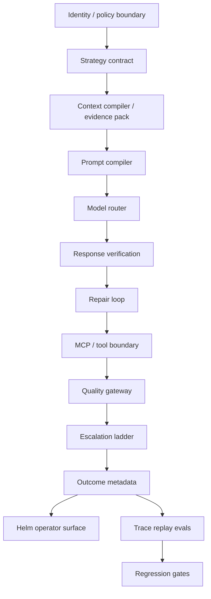
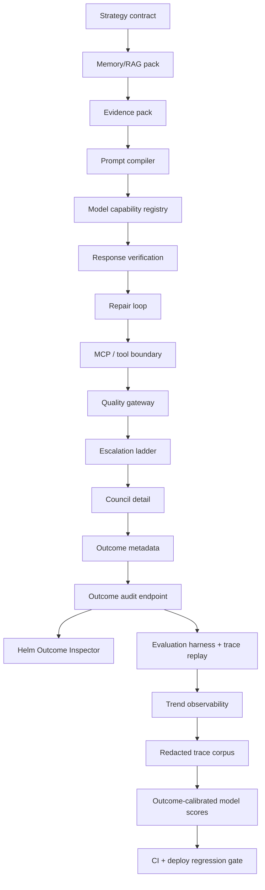

# AT-0 Chat Quality Architecture Review + Gap Ledger

Date: 2026-07-09
Scope: Alpha chat-quality amplification phases 1-23, with Helm as the operator display surface.
Verdict: The shipped system now matches the original direction in architecture shape, but it is not complete. AT-0 has moved beyond routing into context, prompt compilation, memory packing, evidence, verification, bounded repair, MCP/tool trust boundaries, escalation, outcomes, registry-backed routing, trace-seeded eval gates, trend observability, a redacted trace corpus contract, and outcome-calibrated model score overlays. The remaining work is Helm trend rendering and broader real-trace sampling.

## Target Architecture

Original product goal: get frontier-style output from lower and mixed-tier models by surrounding them with software architecture, not by copying proprietary prompts.

Current implementation:

## Shipped Phase Ledger

| Phase | Status | Shipped proof | Goal coverage |
|---|---:|---|---|
| Strategy Contract | Done | `brain/routing/strategy.py:32` selects strategy, route mode, model path, and reason. | Turns "Auto" into an inspectable decision. |
| Context Compiler / Evidence Pack | Done, shallow | `brain/services/chat_evidence_pack.py:17` defines memory, internet, web suggestion, AT-0 self, and conversation evidence metadata. | Starts context engineering, but not full prompt compilation. |
| Response Verification | Done, initial | `brain/services/chat_evidence_pack.py:75` defines response verification metadata; chat streaming applies it at `brain/routes/chat.py:1830`. | Catches empty or unsupported verification claims. |
| Quality Gateway | Done, initial | `brain/services/chat_evidence_pack.py:95` defines gateway decisions; chat applies fallback at `brain/routes/chat.py:1881`. | Adds deterministic output repair before user display. |
| Escalation Ladder | Done, initial | `brain/services/chat_evidence_pack.py:122` defines escalation decisions; web-verification cases require Beacon confirmation at `brain/services/chat_evidence_pack.py:200`. | Moves weak answers to retry, Beacon, or operator review. |
| Council Detail v2 | Done | Council compile emits detail and logs `CHAT_COUNCIL_DETAIL_COMPILED` at `brain/routes/chat.py:1964`. | Makes multi-model output inspectable instead of opaque. |
| Outcome Metadata | Done | Chat stores route, verification, quality, and escalation metadata before final streaming at `brain/routes/chat.py:1840`. | Creates audit trail for output quality. |
| Outcome Audit Endpoint | Done | `/v1/chat/outcomes` returns compact outcome rows at `brain/routes/chat.py:2639`; route is classified read and security-read at `brain/middleware/approval_classes.py:135`. | Lets Helm and evals consume output history safely. |
| Outcome Inspector | Done | Helm renders route, model path, quality, escalation, council, evidence, verified, and confirmation fields in `src/ask/AskWorkspace.tsx:5847`. | Operator sees why an answer happened. |
| Evaluation Harness | Done, shallow | `chat_eval_payload()` returns suite status, groups, scoreboard, and zero model calls at `brain/services/chat_evaluation_harness.py:41`. | Establishes deterministic offline regression checks. |
| Helm Eval Surface | Done | Helm reads `/v1/chat/evals` at `src/ask/alphaAskClient.ts:2255` and renders eval status in `src/ask/AskWorkspace.tsx:5895`. | Makes eval state visible without moving authority to Helm. |
| Deploy Regression Gate | Done | `scripts/eval_chat_quality.py:11` exits nonzero on failures; CI runs it at `.github/workflows/trusted-sandbox-ci.yml:135`; deploy runs it at `scripts/jarvisalpha_deploy.sh:487`. | Prevents known strategy/gateway/outcome regressions from shipping. |
| Prompt Compiler v2 | Done, initial | `brain/services/chat_prompt_compiler.py:16` emits a prompt manifest and section order. | Makes prompt assembly typed and inspectable instead of one giant static prompt. |
| Memory/RAG Packing | Done, initial | `brain/services/chat_memory_pack.py:64` budgets and labels memory before prompt compilation. | Keeps current memory ahead of historical or needs-refresh rows. |
| Model Capability Registry | Done, initial | `brain/routing/model_capability_registry.py:17` stores provider, deployment, cost, latency, context, tool, privacy, and reliability tags. | Moves auto routing away from hardcoded provider mapping. |
| Trace Replay Evals | Done, synthetic | `brain/services/chat_evaluation_harness.py:45` includes synthetic trace replay cases through strategy, memory, prompt, verifier, gateway, and escalation. | Starts replay-based regression proof without storing sensitive raw traces. |
| Repair Loop | Done, initial | `brain/services/chat_repair_loop.py:1` runs one bounded repair pass and `brain/routes/chat.py:1908` applies it before final gateway decisions. | Improves fixable lower-model failures without open-ended self-reflection. |
| MCP Tool Boundary | Done, initial | `brain/services/mcp_tool_boundary.py:1` classifies MCP tools, approval policy, result trust, and prompt-injection sanitization. | Keeps tool output as data and prevents direct prompt/tool execution bypass. |
| Trend Observability | Done, initial | `brain/services/chat_quality_trends.py:1` summarizes compact JSONL eval snapshots, `/v1/chat/evals` reads configured trend history, and `scripts/eval_chat_quality.py:1` can append metadata-only trend history. | Shows whether quality gates are stable, improving, or regressing across deploy/eval runs. |
| Redacted Real Trace Corpus | Done, initial | `brain/services/chat_redacted_trace_corpus.py:1` redacts candidate traces and `docs/evals/chat_redacted_trace_corpus.v1.json` stores replayable metadata-safe cases. | Starts real-trace-style replay without committing raw prompt, response, contact, or private memory text. |
| Outcome-Calibrated Model Scores | Done, initial | `brain/routing/model_score_calibration.py:1` computes reliability deltas from compact outcome metadata and `chat_eval_payload()` exposes `model_calibration`. | Turns static registry scores into inspectable outcome-calibrated overlays without changing live Auto routing yet. |

## Architecture Fit

| Requirement | State | Evidence | Gap |
|---|---:|---|---|
| Model-agnostic strategy selection | Partial | Strategy plan now uses the capability registry for local, Perplexity, Claude, Gemini, council, and deep verify paths; calibration overlays can be computed from outcomes. | Needs controlled rollout before calibrated scores influence live routing. |
| Better lower-model output | Partial | Memory packing, prompt compilation, evidence pack, trace replay, redacted corpus replay, repair loop, model-score calibration, and verification/gateway can replace unsafe or unsupported answers before final stream. | Needs broader redacted trace sampling and per-model benchmarks. |
| Context engineering | Partial | Evidence pack and memory pack record evidence types, memory priority, token budget, freshness labels, and untrusted raw web content. | Ranking is still deterministic and shallow; no learned retrieval policy. |
| Verification and repair | Partial | One bounded repair pass can strip unsupported web narration or retry empty evidence-backed answers before gateway/escalation. | No learned repair policy or multi-step self-critique. |
| Operator observability | Strong | Helm surfaces outcome and eval details; Alpha logs quality and escalation decisions; eval payloads now include trend metadata. | No Helm trend chart or trace replay view. |
| Safety boundary | Strong | Outcome/eval reads are classified `read` and `security_read`; high-risk actions still route through Alpha approvals; MCP tools now have contract-derived boundaries. | Need real invocation wrappers to consume this boundary before broad tool expansion. |
| Evaluation | Partial | Offline deterministic eval suite has golden strategy, memory pack, prompt compiler, quality gateway, trace replay, redacted trace corpus, model-score calibration, and outcome audit groups. | Need more real failure cases and per-model task evals. |

## 11-Pillar Audit

| Pillar | Score | Evidence | Fix |
|---|---:|---|---|
| Scalability | 4 | Strategy, registry, score calibration, and eval are pure local code; outcome endpoint limits rows to 100. | Use calibrated overlays cautiously before adding many providers. |
| Reliability | 4 | Deploy gate now runs chat eval; gateway has fallback responses, bounded repair, synthetic trace replay, and initial redacted corpus replay. | Add broader redacted real failed turns. |
| Security | 4 | Eval/outcome endpoints are authenticated read/security-read; MCP output is classified as untrusted data and prompt-injection-looking text is blocked. | Apply the boundary to any future invocation wrapper. |
| Observability | 4 | Outcome metadata plus Helm inspector exposes route, quality, evidence, escalation, and eval trend status. | Add Helm trend rendering and trace drilldown after real trace corpus exists. |
| Maintainability | 4 | The chain is small modules: routing, evidence pack, eval harness, script gate. | Consolidate phase map in this ledger and keep future phases tied to it. |
| Extensibility | 4 | Strategy names, model paths, model capabilities, and calibration overlays are typed. | Decide when calibrated capabilities feed live routing. |
| Usability / Accessibility | 3 | Helm uses compact chips and inspector panel. | Improve signed-out auth messaging only if operators still hit confusion. |
| Performance | 4 | Evals run offline with zero model calls. | Add cost/latency measurement when provider calls enter evals. |
| Cost | 4 | Current regression suite has `model_calls: 0`. | Keep trace replay deterministic by default; sample paid model evals separately. |
| Testability | 4 | Tests assert eval groups, outcome scoring, deploy/CI gate wiring, synthetic trace replay, and redacted corpus replay. | Add more production-safe anonymized traces. |
| Privacy / Compliance | 4 | Outcome metadata is compact and authenticated; redacted corpus fixtures reject raw contact tokens and raw fields. | Keep raw trace capture out of runtime until approval and retention policy exist. |

Weakest pillars: broader real-trace sampling, learned lower-model repair depth, and live-routing rollout controls for calibrated scores.

## Market Reference Anchors

These are reference anchors, not claims that AT-0 implements each pattern fully.

| Reference | Published practice | AT-0 state |
|---|---|---|
| OpenAI Agents SDK | Official docs describe managed agent loops, handoffs, sessions, tracing, guardrails, and approval pauses: https://developers.openai.com/api/docs/guides/agents | AT-0 has strategy, verification, quality gates, and operator approval boundaries, but not a unified agent loop abstraction. |
| OpenAI Agents tracing | Official tracing docs describe event records for generations, tool calls, handoffs, guardrails, and custom events: https://openai.github.io/openai-agents-python/tracing/ | AT-0 has outcome metadata and synthetic trace replay, but not full production trace replay. |
| Anthropic MCP | Official MCP docs describe an open standard for connecting AI apps to tools, data sources, and workflows: https://modelcontextprotocol.io/docs/getting-started/intro | AT-0 should integrate MCP as a tool boundary after prompt/memory/model registry foundations are stable. |
| LangGraph persistence | Official docs separate short-term checkpointer memory and long-term store memory: https://docs.langchain.com/oss/python/langgraph/persistence | AT-0 has memory systems, but chat-quality packing is not yet a first-class retrieval policy. |
| Google ADK | Official ADK docs describe building, testing, evaluating, and deploying agents: https://docs.cloud.google.com/gemini-enterprise-agent-platform/build/adk | AT-0 now has an eval gate and synthetic trace replay; it needs model-specific eval datasets. |

## Gap Ledger

| Gap | Type | Pillars hit | User impact | Effort | Priority | Owner | Target date | Verification |
|---|---|---|---|---:|---:|---|---|---|
| Repair loop | Closed initial | Reliability, output quality | One bounded repair pass now strips isolated unsupported web narration and retries empty evidence-backed answers once. | M | P1 | Ken/AT-0 | 2026-07-09 | `tests/test_chat_repair_loop.py` and trace replay evals cover repair success and Beacon non-bypass. |
| MCP/tool boundary | Closed initial | Security, extensibility | MCP tools are classified by contract route, risk, approval policy, and untrusted result handling. | M | P1 | Ken/AT-0 | 2026-07-10 | `tests/test_mcp_tool_boundary.py` and `mcp_tool_boundary` eval cover approval-gated render tools and prompt-injection sanitization. |
| Trend observability | Closed initial | Observability, usability | Eval payloads now include trend status, deltas, active failed groups, and next action from compact metadata-only JSONL history. | S | P2 | Ken/AT-0 | 2026-07-10 | `tests/test_chat_quality_trends.py`, `tests/test_chat_internet_metadata.py`, and `scripts/eval_chat_quality.py --record-history` cover trend deltas, route exposure, and compact snapshot persistence. |
| Redacted real trace corpus | Closed initial | Reliability, privacy, evaluation | Redacted replay fixtures can now be loaded, validated, and replayed through the chat eval harness without raw prompt/contact leakage. | M | P1 | Ken/AT-0 | 2026-07-10 | `tests/test_chat_redacted_trace_corpus.py` and `redacted_trace_corpus` eval cover redaction and replay. |
| Outcome-calibrated model scores | Closed initial | Reliability, cost, extensibility | Eval payloads now expose model score calibration from compact outcome rows; future routing can accept calibrated capabilities explicitly. | M | P1 | Ken/AT-0 | 2026-07-10 | `tests/test_chat_model_score_calibration.py`, `tests/test_chat_model_capability_registry.py`, and `model_score_calibration` eval cover score deltas and bounds. |

## Next Build Queue

1. Phase 24: Helm Trend Panel
2. Phase 25: Real Trace Sampling Workflow
3. Phase 26: Calibrated Routing Rollout Gate

## Facts

- Alpha strategy selection is explicit and returns strategy, route mode, model path, and reason metadata in `brain/routing/strategy.py:23`.
- Alpha model capability registry is versioned and records provider, deployment, cost, latency, context window, tool support, privacy tier, and reliability score in `brain/routing/model_capability_registry.py:17`.
- Evidence packing distinguishes memory, internet, web suggestion, AT-0 self, conversation context, memory priority, and untrusted raw web content in `brain/services/chat_evidence_pack.py:17`.
- Prompt compilation emits a manifest with section order, source usage, and tool policy in `brain/services/chat_prompt_compiler.py:16`.
- Memory packing emits a manifest without raw memory text in `brain/services/chat_memory_pack.py:17`.
- Chat streaming applies verification, repair, quality gateway, escalation, outcome metadata, and fallback before final text streaming in `brain/routes/chat.py:1978`.
- Council synthesis receives the same repair/verification/gateway/escalation path in `brain/routes/chat.py:2178`.
- MCP tool boundaries are derived from route classification and contract output fields in `brain/services/mcp_tool_boundary.py:1`.
- `/v1/chat/outcomes` and `/v1/chat/evals` are read/security-read routes in `brain/middleware/approval_classes.py:135`.
- The deterministic eval harness has golden strategy, memory pack, prompt compiler, quality gateway, trace replay, and outcome audit groups in `brain/services/chat_evaluation_harness.py:72`.
- The eval script exits nonzero when payload failures are present in `scripts/eval_chat_quality.py:20`.
- Chat quality trend observability summarizes metadata-only eval snapshots in `brain/services/chat_quality_trends.py:1`.
- `/v1/chat/evals` reads configured chat-quality trend history without mutating state in `brain/routes/chat.py:2903`.
- The eval script can append compact local JSONL history for deploy trend comparisons in `scripts/eval_chat_quality.py:1`.
- Redacted trace corpus fixtures are loaded and validated by `brain/services/chat_redacted_trace_corpus.py:1`.
- The deterministic eval harness includes a `redacted_trace_corpus` group in `brain/services/chat_evaluation_harness.py:64`.
- Outcome-calibrated model score overlays are computed from compact outcome metadata in `brain/routing/model_score_calibration.py:1`.
- `chat_eval_payload()` includes `model_calibration` without making live model calls in `brain/services/chat_evaluation_harness.py:80`.
- Trusted Sandbox CI and deploy now run chat quality evals in `.github/workflows/trusted-sandbox-ci.yml:135` and `scripts/jarvisalpha_deploy.sh:487`.
- Helm reads the eval endpoint and renders an Evaluation Harness section in `src/ask/alphaAskClient.ts:2255` and `src/ask/AskWorkspace.tsx:5895`.

## Assumptions

- "Frontier-style output" means better task framing, evidence grounding, memory selection, verification, and repair around model calls, not imitation of proprietary hidden prompts.
- Local/cloud providers will continue to change, so calibrated scores should remain inspectable until rollout gates prove they improve routing.
- Trace replay must keep raw prompts/responses out of committed fixtures; production sampling needs explicit approval and retention policy.

## Risks

| Severity | Risk | Mitigation |
|---|---|---|
| High | Future trace sampling stores sensitive raw chat content. | Keep Phase 22 fixtures redacted-only; add approval, redaction, and retention before runtime capture. |
| Medium | Calibrated scores steer live routing too early. | Keep Phase 23 as an overlay; add a rollout gate before wiring it into Auto. |
| Medium | Model registry becomes stale. | Keep registry small, versioned, covered by strategy tests, and calibrated from outcomes. |
| Medium | Memory/RAG packing overuses stale memory. | Keep freshness/source priority and Beacon-over-memory tests in the eval gate. |
| Medium | MCP expansion bypasses Alpha approvals. | Require route classification and approval policy before any executable tool. |

## Recommendations

1. Build Helm Trend Panel next.
   - Option A: keep Alpha-only JSON. Safe, but operator discovery stays poor.
   - Option B: compact Helm panel for trend, failed groups, and model calibration. Recommended.
   - Option C: broad analytics dashboard. Later, after sampling and rollout gates exist.
